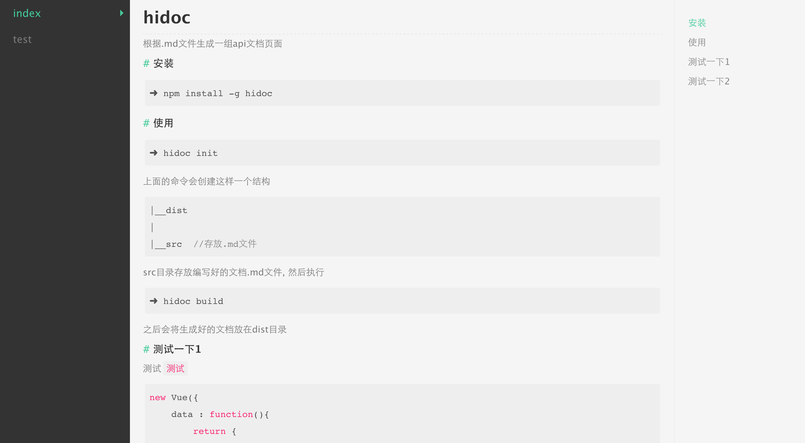

# hidoc
[](https://travis-ci.org/mennghao/hidoc) [](https://www.npmjs.com/package/hidoc) [](https://www.npmjs.com/package/hidoc) [](https://github.com/mennghao/hidoc/blob/master/LICENSE)

根据.md文件生成一组api文档页面

## 安装

```
➜ npm install -g hidoc
```
使用全局安装，安装完成之后会提供一个命令```hidoc```

## 使用

```
➜ hidoc init
```
上面的命令会在当前目录里创建这样一个结构
```
|--dist  //发布目录
|
|--src  //存放.md文件

```

src目录存放编写好的文档```.md```文件, 然后执行下面的命令

```
➜ hidoc build
```
之后会将生成好的文档放在```dist```目录

```
➜ hidoc version
```
查看版本

## 示例

[演示地址](http://mennghao.github.io/hidoc/dist/index.html)

## 页面截图
